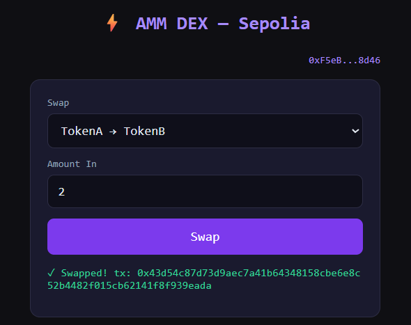

# DEX (Decentralized Exchange)

A simple Decentralized Exchange (DEX) for swapping two ERC20 tokens, built with Foundry.



## Description

This project implements a basic Automated Market Maker (AMM) style DEX on the Sepolia testnet. It allows users to swap between two custom ERC20 tokens: AgoutiHusk (AGTH) and Utonagan (UTNG).

## Features

- Swap between two custom ERC20 tokens.
- Provide liquidity to the liquidity pool.
- Basic frontend to interact with the smart contracts.

## Deployed Contracts (Sepolia)

- **AgoutiHusk (AGTH):** `0xDD8625Ab6Afa9188eAE2eda2F0E87BAdd1c3df59`
- **Utonagan (UTNG):** `0xDe40b09BC26E4aCD6e439D84e5935cC0e25492Fe`
- **LiquidityPool:** `0x46885e57905d7A031B3eb1943442B365bD98a49d`

## Installation and Setup

1.  **Install Foundry:**
    Follow the instructions on the [official Foundry website](https://book.getfoundry.sh/getting-started/installation) to install Foundry.

2.  **Clone the repository and initialize submodules:**
    ```bash
    git clone https://github.com/04arush/AMM-DEX
    cd AMM-DEX
    git submodule update --init --recursive
    ```

3.  **Install dependencies:**
    The project uses `forge-std` and `openzeppelin-contracts` which are included as git submodules. The previous step should have installed them.

4.  **Set up environment variables:**
    You will need to set up a `.env` file with the following variables to deploy and verify contracts:
    ```
    SEPOLIA_RPC_URL=<your_sepolia_rpc_url>
    ETHERSCAN_API_KEY=<your_etherscan_api_key>
    PRIVATE_KEY=<your_private_key>
    ```

## Usage

-   **Build:**
    ```bash
    forge build
    ```

-   **Test:**
    ```bash
    forge test
    ```

-   **Deploy:**
    ```bash
    source .env
    ```
    ```bash
    forge script script/DeployLiquidityPool.s.sol --rpc-url $SEPOLIA_RPC_URL --broadcast --verify -vvvv
    ```

-   **Frontend:**
    ```bash
    cd frontend
    ```
    ```bash
    python -m http.server 8080
    ```
    Open https://localhost:8080/ in your browser and connect your wallet.

## Libraries Used

-   [Foundry](https://github.com/foundry-rs/foundry)
-   [OpenZeppelin Contracts](https://github.com/OpenZeppelin/openzeppelin-contracts)
